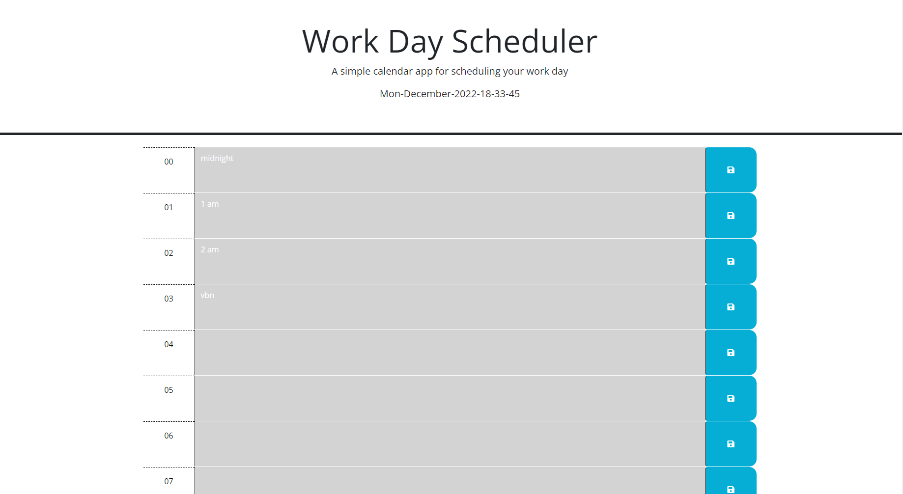

# dateraiding
## a calendar app

The purpose of this application is a simple day-planner, with a highlighted colourcode for future, past and present tenses, all stored in local storage!

## Visit the Website
[click me!](https://azrazel95.github.io/dateraiding/)

## contributing

please do not contribute

## License

This project has been licensed under the MIT License

---

© benjamin sprenger 
